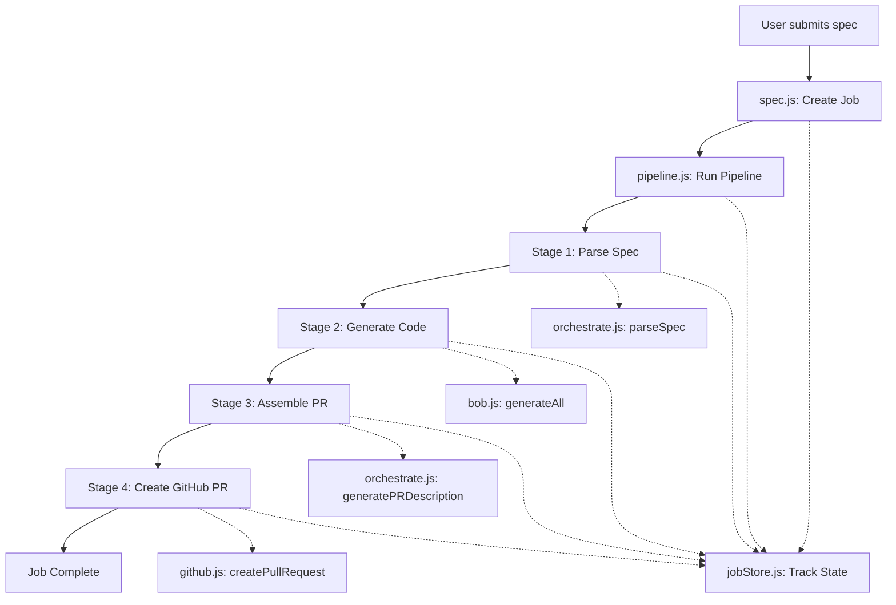

# Backend Pipeline Analysis: Plain-English to GitHub Pull Request

## Overview

The Spec-to-Ship backend converts plain-English feature requests into GitHub pull requests through a 4-stage pipeline orchestrated across multiple services. The system uses an asynchronous job-based architecture with status tracking.

## Architecture Flow



## Component Breakdown

### 1. Entry Point: `backend/src/routes/spec.js`

**Purpose:** HTTP endpoint that receives feature requests and initiates the pipeline.

**Key Functions:**
- Validates incoming spec (minimum 10 characters)
- Generates unique job ID using UUID
- Creates job record in job store
- Launches async pipeline execution
- Returns 202 Accepted with job ID for status polling

**Code Flow:**
```javascript
POST /spec
├── Validate spec length
├── Generate jobId = uuidv4()
├── createJob(jobId, spec)
├── runPipeline(job).catch(console.error)  // Fire and forget
└── Return 202 { jobId, status: 'queued' }
```

**Important Design Decision:** The pipeline runs asynchronously (fire-and-forget pattern), allowing immediate response to the client while processing continues in the background.

---

### 2. Pipeline Orchestrator: `backend/src/services/pipeline.js`

**Purpose:** Coordinates the 4-stage transformation from spec to pull request.

**Pipeline Stages:**

#### Stage 1: PARSING (status: 'parsing')
- Calls `parseSpec(job.spec)` from orchestrate agent
- Converts plain-English into structured task list
- Updates job with parsed tasks
- **Current Implementation:** Stub that returns single generic task
- **Intended Implementation:** Should call watsonx Orchestrate agent to decompose spec into:
  - Feature name
  - Task breakdown with target files
  - Acceptance criteria
  - Affected files list

#### Stage 2: GENERATING (status: 'generating')
- Calls `generateAll(parsed.tasks)` from Bob service
- Transforms each task into actual code content
- Returns array of `{ taskId, targetFile, content }`
- **Current Implementation:** Simple template-based code generation
- **Intended Implementation:** Should use AI code generation (Bob agent)

#### Stage 3: ASSEMBLING (status: 'assembling')
- Calls `generatePRDescription(parsed.summary)` from orchestrate agent
- Creates professional PR title and body
- Stores generated files in job state
- **Current Implementation:** Returns generic PR metadata
- **Intended Implementation:** Should call watsonx Orchestrate PR Description agent

#### Stage 4: CREATING PR (status: 'done')
- Calls `createPullRequest(outputs, prDescription)` from GitHub service
- Creates branch, commits files, opens PR
- Updates job with final PR URL

**Error Handling:**
- Any stage failure updates job status to 'failed'
- Error message stored in job.error field
- Pipeline halts on first error

**Timing:**
- 1-second delays between stages for demo/visibility purposes
- Production would remove these artificial delays

---

### 3. State Management: `backend/src/services/jobStore.js`

**Purpose:** In-memory job state tracking using Map data structure.

**Data Model:**
```javascript
{
  id: 'uuid',
  spec: 'original plain-English request',
  status: 'queued' | 'parsing' | 'generating' | 'assembling' | 'done' | 'failed',
  tasks: [],           // Populated after parsing
  generatedFiles: [],  // Populated after generation
  prUrl: null,         // Populated when PR created
  error: null,         // Populated on failure
  createdAt: 'ISO timestamp'
}
```

**Key Functions:**
- `createJob(id, spec)`: Initialize new job with 'queued' status
- `updateJob(id, patch)`: Merge updates into existing job
- `getJob(id)`: Retrieve job by ID for status polling

**Important Note:** Uses in-memory Map, so jobs are lost on server restart. Production would use persistent storage (Redis, PostgreSQL, etc.).

---

### 4. GitHub Integration: `backend/src/services/github.js`

**Purpose:** Handles all GitHub API interactions using Octokit.

**Configuration (from environment variables):**
- `GITHUB_TOKEN`: Personal access token for authentication
- `GITHUB_OWNER`: Repository owner username/org
- `GITHUB_REPO`: Repository name
- `GITHUB_BASE_BRANCH`: Target branch (default: 'main')

**Workflow:**

#### Step 1: Get Base SHA
```javascript
getBaseSHA()
├── Fetch current commit SHA of base branch
└── Used as starting point for new branch
```

#### Step 2: Create Feature Branch
```javascript
createBranch(branchName, sha)
├── Branch name: 'spec-to-ship/generated-{timestamp}'
└── Creates ref at refs/heads/{branchName}
```

#### Step 3: Commit Generated Files
```javascript
commitFile(branchName, filePath, content)
├── Check if file exists (get current SHA if updating)
├── Base64 encode content
├── Create/update file with commit message
└── Repeat for each generated file
```

**Smart File Handling:**
- Attempts to get existing file SHA
- If file exists: updates with SHA (preserves history)
- If file doesn't exist: creates new file
- Each file gets individual commit with message: `feat: generate {filePath} via Spec-to-Ship`

#### Step 4: Open Pull Request
```javascript
openPR(branchName, title, body)
├── Create PR from feature branch to base branch
├── Use generated title and description
└── Return PR HTML URL
```

---

### 5. Agent Services: `backend/src/agents/orchestrate.js`

**Purpose:** Interface to watsonx Orchestrate AI agents.

**Current State:** Stub implementations returning hardcoded data.

**Intended Architecture:**

#### Spec Parser Agent
- **Input:** Plain-English feature request
- **Output:** Structured JSON with:
  - `featureName`: Short descriptive name
  - `summary`: One-sentence overview
  - `tasks[]`: Array of implementation tasks with:
    - `id`: Unique task identifier
    - `type`: Task type (e.g., 'code')
    - `description`: Exact implementation instructions
    - `targetFile`: Where to write the code
    - `context`: Additional implementation context
  - `acceptanceCriteria[]`: Success criteria
  - `affectedFiles[]`: List of files that will change

#### PR Description Agent
- **Input:** Feature summary or task list
- **Output:** Professional PR metadata:
  - `title`: Conventional commit format (e.g., "feat: add JWT authentication")
  - `body`: Markdown-formatted PR description with:
    - Summary section
    - Changes list
    - Testing checklist

**Integration Point:** These agents are deployed in watsonx Orchestrate and should be called via API, but current implementation uses stubs for development.

---

### 6. Code Generation: `backend/src/services/bob.js`

**Purpose:** Generates actual code content from task descriptions.

**Current Implementation:**
- Simple template that wraps task description in JavaScript function
- Returns boilerplate code with task description as comment

**Intended Implementation:**
- Should integrate with AI code generation service (Bob agent)
- Would generate production-ready code based on:
  - Task description
  - Target file context
  - Project conventions
  - Language/framework requirements

**Output Format:**
```javascript
[
  {
    taskId: 'task_1',
    targetFile: 'src/generated/feature.js',
    content: '// actual generated code'
  }
]
```

---

## Complete Request Flow Example

### User Request
```
POST /spec
{
  "spec": "Add JWT login authentication with protected routes"
}
```

### Step-by-Step Execution

1. **spec.js receives request**
   - Validates spec length
   - Creates job: `{ id: 'abc-123', status: 'queued', spec: '...' }`
   - Returns: `202 { jobId: 'abc-123', status: 'queued' }`

2. **pipeline.js starts async processing**
   - Updates: `status: 'parsing'`
   - Calls `parseSpec()` → returns structured tasks
   - Updates: `status: 'generating', tasks: [...]`

3. **Code generation**
   - Calls `generateAll(tasks)` → returns code for each task
   - Updates: `status: 'assembling', generatedFiles: [...]`

4. **PR preparation**
   - Calls `generatePRDescription()` → returns PR title/body
   - Calls `createPullRequest()`:
     - Gets base branch SHA
     - Creates branch: `spec-to-ship/generated-1234567890`
     - Commits each generated file
     - Opens PR with generated description

5. **Completion**
   - Updates: `status: 'done', prUrl: 'https://github.com/...'`
   - Job now contains full history and PR link

### Client Polling
```
GET /jobs/abc-123
{
  "id": "abc-123",
  "status": "done",
  "prUrl": "https://github.com/owner/repo/pull/42",
  "tasks": [...],
  "generatedFiles": [...]
}
```

---

## Key Design Patterns

### 1. Asynchronous Job Pattern
- Immediate response with job ID
- Client polls for status updates
- Prevents timeout on long-running operations

### 2. State Machine
- Clear status progression: queued → parsing → generating → assembling → done
- Each stage updates job state
- Failed state for error handling

### 3. Service Separation
- **Routes:** HTTP interface
- **Pipeline:** Orchestration logic
- **JobStore:** State management
- **GitHub:** External API integration
- **Agents:** AI/ML services
- **Bob:** Code generation

### 4. Error Isolation
- Try-catch in pipeline catches all stage errors
- Errors don't crash server
- Job state preserves error information

---

## Current Limitations & Future Enhancements

### Current Limitations
1. **In-memory job storage** - Lost on restart
2. **Stub AI agents** - Not calling real watsonx Orchestrate
3. **Simple code generation** - Template-based, not AI-powered
4. **No authentication** - Anyone can submit specs
5. **No rate limiting** - Could be abused
6. **Single repository** - Hardcoded GitHub repo

### Planned Enhancements
1. **Persistent storage** - Redis or PostgreSQL for job state
2. **Real AI integration** - Connect to watsonx Orchestrate agents
3. **Advanced code generation** - Use Bob AI agent for production code
4. **Multi-repository support** - Allow repo selection per request
5. **Webhook notifications** - Push updates instead of polling
6. **Authentication & authorization** - Secure the API
7. **Retry logic** - Handle transient failures
8. **Logging & monitoring** - Track pipeline performance

---

## Environment Configuration

Required environment variables:
```bash
GITHUB_TOKEN=ghp_xxxxx          # GitHub personal access token
GITHUB_OWNER=username           # Repository owner
GITHUB_REPO=repo-name          # Repository name
GITHUB_BASE_BRANCH=main        # Target branch (optional)
```

---

## Summary

The Spec-to-Ship backend implements a sophisticated pipeline that transforms natural language into working code through four distinct stages:

1. **Parse** - Convert English to structured tasks (orchestrate.js)
2. **Generate** - Create code from tasks (bob.js)
3. **Assemble** - Prepare PR metadata (orchestrate.js)
4. **Ship** - Create GitHub PR (github.js)

The system uses an asynchronous job-based architecture with clear state management, allowing clients to track progress through status polling. While current implementations use stubs for AI services, the architecture is designed to integrate with watsonx Orchestrate agents for production-grade spec parsing and PR description generation, plus AI-powered code generation through the Bob service.