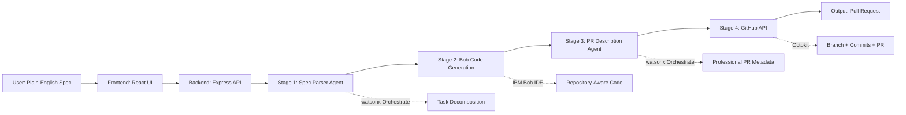
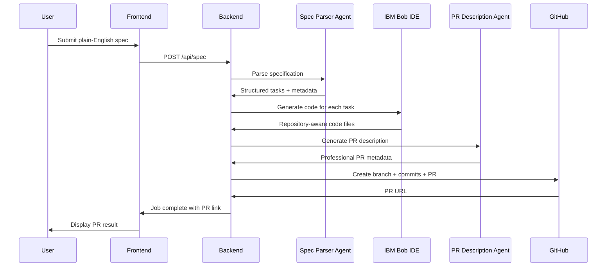
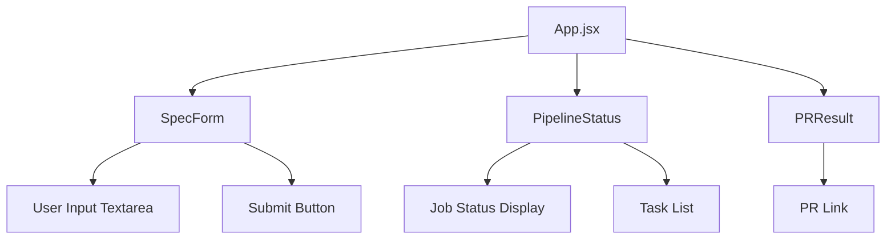
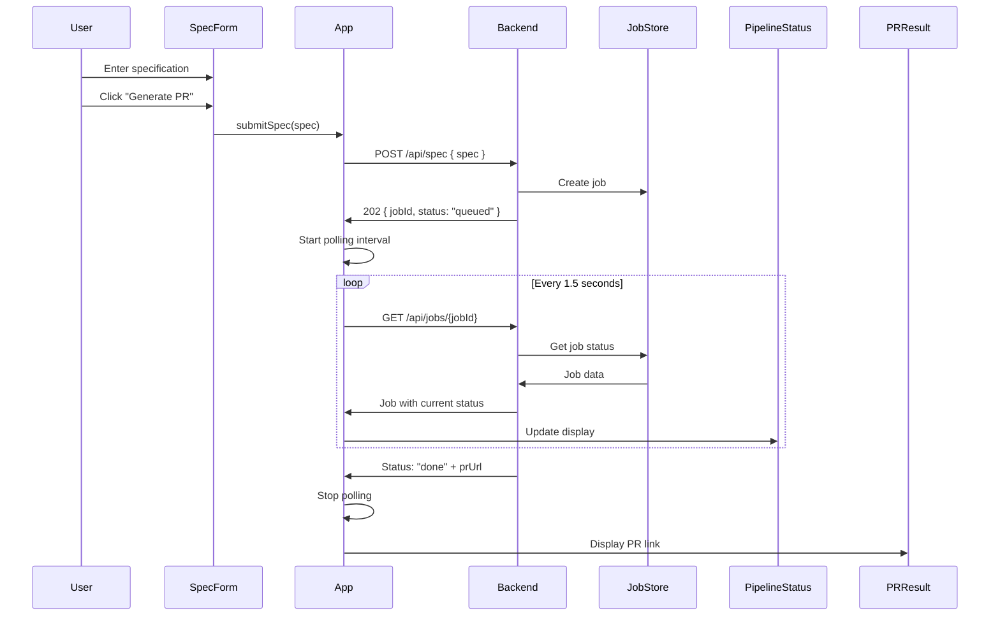

# spec-to-ship

**AI-Powered Engineering Workflow: From Plain-English Specifications to GitHub Pull Requests**

Spec-to-Ship is an automated software delivery pipeline that transforms natural language feature requests into production-ready GitHub pull requests. Built with IBM Bob IDE as the repository-aware development partner and watsonx Orchestrate agents for intelligent task decomposition, this system demonstrates the future of AI-assisted software engineering.

---

## 🏗️ System Architecture

Spec-to-Ship orchestrates a 4-stage pipeline that bridges the gap between human intent and executable code:



---

## 🤖 IBM Bob IDE: Repository-Aware Engineering Assistant

### Role in the Pipeline

IBM Bob IDE serves as the **intelligent code generation engine** that understands your repository context and generates production-ready code. Unlike traditional code generators that work in isolation, Bob is repository-aware, meaning it:

- **Analyzes existing codebase patterns** to match your project's coding style
- **Understands project structure** to place generated files in appropriate locations
- **Respects language conventions** and framework best practices
- **Generates contextual code** that integrates seamlessly with existing implementations

### How Bob Works in Spec-to-Ship

1. **Receives Structured Tasks**: After watsonx Orchestrate agents decompose the user's specification into actionable tasks, Bob receives:
   ```javascript
   {
     id: "task_1",
     type: "code",
     description: "Create JWT authentication middleware",
     targetFile: "src/middleware/auth.js",
     context: "Express.js application with existing user model"
   }
   ```

2. **Repository Context Analysis**: Bob examines the target repository to understand:
   - Existing file structure and naming conventions
   - Language/framework versions and dependencies
   - Code style and formatting preferences
   - Related implementations for consistency

3. **Intelligent Code Generation**: Bob generates production-ready code that:
   - Follows project conventions automatically
   - Includes proper error handling and edge cases
   - Integrates with existing modules and dependencies
   - Includes inline documentation and comments

4. **Output Format**: Bob returns generated code ready for commit:
   ```javascript
   {
     taskId: "task_1",
     targetFile: "src/middleware/auth.js",
     content: "// Production-ready, repository-aware code"
   }
   ```

### Bob's Repository-Aware Advantages

| Traditional Code Gen | IBM Bob IDE |
|---------------------|-------------|
| Generic templates | Context-aware implementations |
| Manual integration required | Seamless codebase integration |
| Style inconsistencies | Matches existing patterns |
| Isolated code snippets | Holistic repository understanding |

---

## 🧠 watsonx Orchestrate Agents: Intelligent Task Structuring

### Agent Architecture

Spec-to-Ship leverages **two specialized watsonx Orchestrate agents** that work in tandem to transform natural language into structured engineering workflows:

#### 1. Spec Parser Agent

**Purpose**: Converts plain-English feature requests into structured, actionable engineering tasks.

**Input Example**:
```
"Add JWT login authentication with protected routes and session validation"
```

**Output Schema**:
```json
{
  "featureName": "JWT Authentication System",
  "summary": "Implement secure JWT-based authentication with route protection",
  "tasks": [
    {
      "id": "task_1",
      "type": "code",
      "description": "Create JWT token generation utility with 24h expiration",
      "targetFile": "src/utils/jwt.js",
      "context": "Use jsonwebtoken library, store secret in environment variables"
    },
    {
      "id": "task_2",
      "type": "code",
      "description": "Implement authentication middleware for protected routes",
      "targetFile": "src/middleware/auth.js",
      "context": "Verify JWT tokens, attach user data to request object"
    },
    {
      "id": "task_3",
      "type": "code",
      "description": "Create login endpoint with credential validation",
      "targetFile": "src/routes/auth.js",
      "context": "Hash password comparison, return JWT on success"
    }
  ],
  "acceptanceCriteria": [
    "Users can login with valid credentials and receive JWT token",
    "Protected routes reject requests without valid tokens",
    "Tokens expire after 24 hours and require re-authentication"
  ],
  "affectedFiles": [
    "src/utils/jwt.js",
    "src/middleware/auth.js",
    "src/routes/auth.js",
    "package.json"
  ]
}
```

**Key Capabilities**:
- **Intent Understanding**: Extracts engineering requirements from conversational language
- **Task Decomposition**: Breaks complex features into atomic, implementable units
- **File Targeting**: Identifies exactly where code should be written
- **Context Enrichment**: Provides implementation guidance for each task
- **Dependency Detection**: Recognizes affected files and system components

#### 2. PR Description Agent

**Purpose**: Generates professional GitHub pull request metadata from structured task lists.

**Input Example**:
```json
{
  "featureName": "JWT Authentication System",
  "tasks": [
    { "description": "Create JWT token generation utility" },
    { "description": "Implement authentication middleware" },
    { "description": "Create login endpoint" }
  ]
}
```

**Output Schema**:
```json
{
  "title": "feat: implement JWT authentication system",
  "body": "## Summary\n\nAdds secure JWT-based authentication with route protection and session management.\n\n## Changes\n- ✨ JWT token generation utility with configurable expiration\n- 🔒 Authentication middleware for protected routes\n- 🚪 Login endpoint with credential validation\n- 📦 Added jsonwebtoken dependency\n\n## Testing\n- [ ] Verify users can login with valid credentials\n- [ ] Confirm protected routes reject invalid tokens\n- [ ] Test token expiration after 24 hours\n- [ ] Validate error handling for malformed tokens"
}
```

**Key Capabilities**:
- **Conventional Commits**: Generates semantic commit-style PR titles
- **Structured Documentation**: Creates clear, scannable PR descriptions
- **Testing Checklists**: Automatically generates test scenarios
- **Change Categorization**: Organizes changes by type (features, fixes, etc.)

### Agent Workflow in Pipeline



---

## 🔄 Backend Pipeline: From Spec to Pull Request

### Pipeline Stages

The backend orchestrates a **4-stage asynchronous pipeline** that transforms specifications into pull requests:

#### Stage 1: PARSING (Status: `parsing`)

**Objective**: Convert natural language into structured engineering tasks

**Process**:
1. Receives plain-English specification from frontend
2. Calls **Spec Parser Agent** (watsonx Orchestrate)
3. Receives structured task breakdown with:
   - Feature name and summary
   - Individual implementation tasks
   - Target files for each task
   - Acceptance criteria
   - List of affected files

**Code Location**: [`backend/src/agents/orchestrate.js`](backend/src/agents/orchestrate.js:1)

**Example Transformation**:
```
Input:  "Add user profile page with avatar upload"
Output: {
  featureName: "User Profile Management",
  tasks: [
    { id: "task_1", description: "Create profile component", targetFile: "src/components/Profile.jsx" },
    { id: "task_2", description: "Add avatar upload API", targetFile: "src/api/upload.js" }
  ]
}
```

#### Stage 2: GENERATING (Status: `generating`)

**Objective**: Transform tasks into actual code using repository-aware AI

**Process**:
1. Receives structured tasks from Stage 1
2. For each task, calls **IBM Bob IDE** with:
   - Task description
   - Target file path
   - Repository context
3. Bob analyzes existing codebase patterns
4. Generates production-ready code that matches project style
5. Returns array of generated files with content

**Code Location**: [`backend/src/services/bob.js`](backend/src/services/bob.js:1)

**Output Format**:
```javascript
[
  {
    taskId: "task_1",
    targetFile: "src/components/Profile.jsx",
    content: "// Repository-aware React component code"
  },
  {
    taskId: "task_2",
    targetFile: "src/api/upload.js",
    content: "// Repository-aware API endpoint code"
  }
]
```

#### Stage 3: ASSEMBLING (Status: `assembling`)

**Objective**: Create professional pull request metadata

**Process**:
1. Receives feature summary and task list
2. Calls **PR Description Agent** (watsonx Orchestrate)
3. Generates:
   - Semantic PR title (conventional commits format)
   - Structured PR body with summary, changes, and testing checklist
4. Prepares metadata for GitHub PR creation

**Code Location**: [`backend/src/agents/orchestrate.js`](backend/src/agents/orchestrate.js:14)

**Example Output**:
```json
{
  "title": "feat: add user profile management with avatar upload",
  "body": "## Summary\n\nImplements user profile page...\n\n## Changes\n- Profile component\n- Avatar upload API\n\n## Testing\n- [ ] Profile displays user data\n- [ ] Avatar upload works"
}
```

#### Stage 4: CREATING PR (Status: `done`)

**Objective**: Commit generated code and open GitHub pull request

**Process**:
1. **Get Base Branch SHA**: Fetches current commit of target branch (e.g., `main`)
2. **Create Feature Branch**: Creates timestamped branch (`spec-to-ship/generated-{timestamp}`)
3. **Commit Files**: For each generated file:
   - Checks if file exists (gets SHA for updates)
   - Base64 encodes content
   - Creates/updates file with commit message
   - Each file gets individual commit
4. **Open Pull Request**:
   - Creates PR from feature branch to base branch
   - Uses generated title and description
   - Returns PR URL

**Code Location**: [`backend/src/services/github.js`](backend/src/services/github.js:1)

**GitHub API Operations**:
```javascript
// 1. Get base branch SHA
GET /repos/{owner}/{repo}/branches/{branch}

// 2. Create feature branch
POST /repos/{owner}/{repo}/git/refs
{
  "ref": "refs/heads/spec-to-ship/generated-1234567890",
  "sha": "{base_sha}"
}

// 3. Commit each file
PUT /repos/{owner}/{repo}/contents/{path}
{
  "message": "feat: generate {path} via Spec-to-Ship",
  "content": "{base64_content}",
  "branch": "spec-to-ship/generated-1234567890"
}

// 4. Create pull request
POST /repos/{owner}/{repo}/pulls
{
  "title": "feat: add user profile management",
  "body": "## Summary\n\n...",
  "head": "spec-to-ship/generated-1234567890",
  "base": "main"
}
```

### Pipeline State Management

**Job Status Flow**:
```
queued → parsing → generating → assembling → done
                                            ↓
                                         failed
```

**Job Data Structure**:
```javascript
{
  id: "uuid",
  spec: "original user specification",
  status: "queued" | "parsing" | "generating" | "assembling" | "done" | "failed",
  tasks: [],           // Populated after parsing
  generatedFiles: [],  // Populated after generation
  prUrl: null,         // Populated when PR created
  error: null,         // Populated on failure
  createdAt: "ISO timestamp"
}
```

**Code Location**: [`backend/src/services/jobStore.js`](backend/src/services/jobStore.js:1)

### Error Handling

- **Stage Failures**: Any stage error updates job status to `failed`
- **Error Preservation**: Error messages stored in `job.error` field
- **Pipeline Halt**: Pipeline stops on first error (no partial PRs)
- **Client Notification**: Frontend polls job status and displays errors

---

## 🎨 Frontend: User Interface & Real-Time Updates

### Architecture Overview

The frontend is a **React single-page application** that provides a clean interface for submitting specifications and monitoring pipeline progress in real-time.

**Tech Stack**:
- React 18 with Hooks
- Axios for HTTP requests
- Vite for build tooling
- CSS for styling

**Code Location**: [`frontend/src/App.jsx`](frontend/src/App.jsx:1)

### Component Structure



#### 1. SpecForm Component

**Purpose**: Captures user's plain-English feature specification

**Features**:
- Multi-line textarea for detailed specifications
- Submit button with loading state
- Disabled during pipeline execution

**Code Location**: [`frontend/src/components/SpecForm.jsx`](frontend/src/components/SpecForm.jsx:1)

**User Flow**:
```
User types spec → Clicks "Generate PR" → Button shows "Running Pipeline..."
```

#### 2. PipelineStatus Component

**Purpose**: Real-time visualization of pipeline progress

**Displays**:
- Current pipeline stage (parsing, generating, assembling, done)
- Original specification text
- Generated task breakdown (after parsing stage)
- Task details (type, description, target file)

**Code Location**: [`frontend/src/components/PipelineStatus.jsx`](frontend/src/components/PipelineStatus.jsx:1)

**Visual States**:
```
Status: parsing     → "Analyzing specification..."
Status: generating  → "Generating code..." + Task list
Status: assembling  → "Preparing pull request..."
Status: done        → "Complete!" + Task list
Status: failed      → "Error: {message}"
```

#### 3. PRResult Component

**Purpose**: Displays final pull request link

**Features**:
- Clickable GitHub PR URL
- Only visible when pipeline completes successfully
- Opens PR in new tab

**Code Location**: [`frontend/src/components/PRResult.jsx`](frontend/src/components/PRResult.jsx:1)

### Frontend-Backend Interaction

#### Request Flow



#### API Endpoints

**1. Submit Specification**
```javascript
POST http://localhost:8080/api/spec
Content-Type: application/json

{
  "spec": "Add JWT authentication with protected routes"
}

Response: 202 Accepted
{
  "success": true,
  "jobId": "abc-123-def-456",
  "status": "queued"
}
```

**2. Poll Job Status**
```javascript
GET http://localhost:8080/api/jobs/{jobId}

Response: 200 OK
{
  "id": "abc-123-def-456",
  "spec": "Add JWT authentication...",
  "status": "generating",
  "tasks": [
    {
      "id": "task_1",
      "type": "code",
      "description": "Create JWT utility",
      "targetFile": "src/utils/jwt.js"
    }
  ],
  "generatedFiles": [],
  "prUrl": null,
  "createdAt": "2026-05-17T06:30:00.000Z"
}
```

#### Polling Strategy

**Implementation**:
```javascript
useEffect(() => {
  if (!jobId) return;

  const interval = setInterval(async () => {
    const response = await axios.get(`${API_URL}/api/jobs/${jobId}`);
    setJob(response.data);

    // Stop polling when complete or failed
    if (response.data.status === 'done' || response.data.status === 'failed') {
      setLoading(false);
      clearInterval(interval);
    }
  }, 1500); // Poll every 1.5 seconds

  return () => clearInterval(interval);
}, [jobId]);
```

**Polling Characteristics**:
- **Interval**: 1.5 seconds between requests
- **Start Trigger**: Immediately after receiving job ID
- **Stop Conditions**: 
  - Job status becomes `done`
  - Job status becomes `failed`
  - Component unmounts
- **Error Handling**: Logs errors but continues polling

#### State Management

**App-Level State**:
```javascript
const [jobId, setJobId] = useState(null);      // Current job identifier
const [job, setJob] = useState(null);          // Full job object with status
const [loading, setLoading] = useState(false); // UI loading state
```

**State Flow**:
```
Initial:  jobId=null, job=null, loading=false
Submit:   jobId="abc-123", job=null, loading=true
Polling:  jobId="abc-123", job={status:"parsing"}, loading=true
Complete: jobId="abc-123", job={status:"done", prUrl:"..."}, loading=false
```

### User Experience Flow

1. **Initial State**: User sees empty form with "Generate PR" button
2. **Submission**: User enters spec and clicks button
   - Button text changes to "Running Pipeline..."
   - Button becomes disabled
3. **Parsing Stage**: Status card appears showing "parsing"
4. **Generating Stage**: Status updates to "generating" with task list
5. **Assembling Stage**: Status updates to "assembling"
6. **Completion**: 
   - Status shows "done"
   - PR Result card appears with clickable GitHub link
   - Button re-enables for new submission

### Error Handling

**Network Errors**:
```javascript
try {
  const response = await axios.post(`${API_URL}/api/spec`, { spec });
  setJobId(response.data.jobId);
} catch (error) {
  console.error(error);
  // User sees no feedback (improvement opportunity)
}
```

**Pipeline Errors**:
- Backend sets job status to `failed`
- Frontend displays error in PipelineStatus component
- Polling stops automatically

---

## 🚀 Getting Started

### Prerequisites

- Node.js 18+
- GitHub Personal Access Token with `repo` scope
- Target GitHub repository for PR creation

### Environment Configuration

Create [`backend/.env`](backend/.env.example:1):
```bash
GITHUB_TOKEN=ghp_xxxxxxxxxxxxx
GITHUB_OWNER=your-username
GITHUB_REPO=your-repo
GITHUB_BASE_BRANCH=main
PORT=8080
FRONTEND_URL=http://localhost:5173
```

### Installation & Running

**Backend**:
```bash
cd backend
npm install
npm start
# Server runs on http://localhost:8080
```

**Frontend**:
```bash
cd frontend
npm install
npm run dev
# UI runs on http://localhost:5173
```

### Usage Example

1. Open http://localhost:5173
2. Enter specification:
   ```
   Add a user authentication system with JWT tokens,
   login/logout endpoints, and protected route middleware
   ```
3. Click "Generate PR"
4. Watch real-time pipeline progress
5. Click PR link when complete to review generated code

---

## 🔧 Technical Implementation Details

### Key Design Patterns

**1. Asynchronous Job Pattern**
- Immediate HTTP response with job ID
- Long-running pipeline executes in background
- Client polls for status updates
- Prevents HTTP timeouts on slow operations

**2. State Machine Architecture**
- Clear status progression through pipeline stages
- Each stage updates centralized job state
- Failed state for error isolation
- Enables precise progress tracking

**3. Service Separation**
- **Routes**: HTTP interface layer
- **Pipeline**: Orchestration logic
- **JobStore**: State management
- **GitHub**: External API integration
- **Agents**: AI/ML service interfaces
- **Bob**: Code generation engine

**4. Repository-Aware Generation**
- Bob analyzes existing codebase before generating
- Matches project conventions automatically
- Integrates seamlessly with existing code
- Reduces manual integration work

### Technology Stack

**Backend**:
- Express.js - Web framework
- Octokit - GitHub API client
- UUID - Job ID generation
- dotenv - Environment configuration

**Frontend**:
- React 18 - UI framework
- Axios - HTTP client
- Vite - Build tool and dev server

**AI Services**:
- IBM Bob IDE - Repository-aware code generation
- watsonx Orchestrate - Task decomposition and PR description

---

## 📊 System Capabilities

### What Spec-to-Ship Can Do

✅ **Natural Language Processing**: Understands conversational feature requests  
✅ **Intelligent Task Breakdown**: Decomposes complex features into atomic tasks  
✅ **Repository-Aware Code Generation**: Generates code that matches your project style  
✅ **Automated Git Operations**: Creates branches, commits, and pull requests  
✅ **Professional PR Documentation**: Generates semantic titles and structured descriptions  
✅ **Real-Time Progress Tracking**: Live updates on pipeline execution  
✅ **Error Handling**: Graceful failure with detailed error messages  

### Current Limitations

⚠️ **In-Memory Job Storage**: Jobs lost on server restart (use Redis/PostgreSQL for production)  
⚠️ **Single Repository**: Hardcoded target repository (add repo selection for multi-repo support)  
⚠️ **No Authentication**: Open API without user authentication (add auth for production)  
⚠️ **Polling-Based Updates**: Client polls for status (consider WebSockets for real-time push)  
⚠️ **No Rate Limiting**: Unlimited submissions (add rate limiting to prevent abuse)  

---

## 🎯 Use Cases

### Ideal Scenarios

1. **Rapid Prototyping**: Quickly generate boilerplate code for new features
2. **Consistent Code Style**: Ensure all generated code matches project conventions
3. **Documentation Generation**: Create standardized PR descriptions automatically
4. **Junior Developer Support**: Provide structured implementation guidance
5. **Feature Scaffolding**: Generate initial implementation for complex features

### Example Specifications

**Authentication System**:
```
Add JWT-based authentication with login/logout endpoints,
password hashing using bcrypt, and middleware to protect
private routes. Include refresh token support.
```

**REST API Endpoint**:
```
Create a REST API endpoint for user profile management
with GET, PUT, and DELETE operations. Include input
validation and error handling.
```

**Database Integration**:
```
Add PostgreSQL database integration with connection pooling,
migration support, and a User model with CRUD operations.
```

---

## 🔮 Future Enhancements

### Planned Features

- **Multi-Repository Support**: Select target repository per request
- **Persistent Job Storage**: Redis or PostgreSQL for job state
- **WebSocket Updates**: Real-time push notifications instead of polling
- **Authentication & Authorization**: Secure API with user accounts
- **Advanced Code Review**: AI-powered code quality checks before PR creation
- **Custom Templates**: User-defined code generation templates
- **Rollback Support**: Ability to close PRs and revert changes
- **Batch Processing**: Submit multiple specifications at once
- **Integration Tests**: Automatically generate test files alongside code

---

## 📚 Additional Resources

- **Backend Pipeline Analysis**: [`docs/backend-pipeline-analysis.md`](docs/backend-pipeline-analysis.md:1)
- **Production Readiness**: [`docs/production-readiness-improvements.md`](docs/production-readiness-improvements.md:1)
- **Spec Parser Agent Details**: [`docs/orchestrate-agents/01-spec-parser-agent/agent-details.txt`](docs/orchestrate-agents/01-spec-parser-agent/agent-details.txt:1)
- **PR Description Agent Details**: [`docs/orchestrate-agents/02-pr-description-agent/agent-details.txt`](docs/orchestrate-agents/02-pr-description-agent/agent-details.txt:1)

---

## 🤝 Contributing

Contributions are welcome! This project demonstrates the integration of IBM Bob IDE and watsonx Orchestrate for automated software delivery. Areas for contribution:

- Enhanced error handling and retry logic
- Additional AI agent integrations
- UI/UX improvements
- Test coverage
- Documentation improvements

---

## 📄 License

MIT License - See LICENSE file for details

---

**Built with ❤️ using IBM Bob IDE and watsonx Orchestrate**